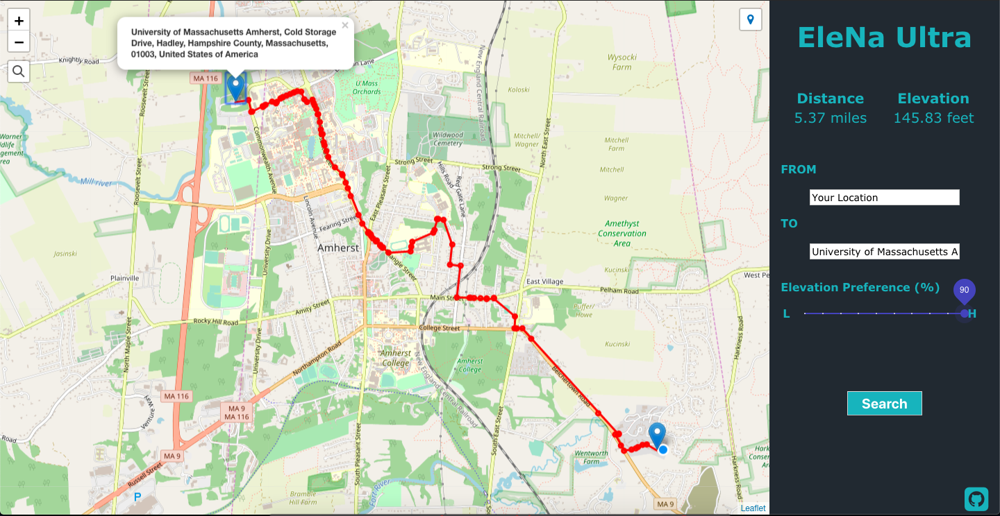

# elevation-based-navigation



This app is the project from cs520 class at UMass Amherst in Fall, 2019. The goal is to develop a live map web/mobile app that provides users the convenience to find itinerary with the least elevation. It can benefit people especially bikers and disabilities so they can save their effort from climbing. 

## Getting Started

### Prerequisites

You will need `node.js` and `npm` installed on your machine.<br />
Please install them before you proceed. 

```
# open termianl
brew update

# install node.js and npm
brew install node

# test if the installation succeed and versions
node -v
npm -v
```

### Installing

Clone and direct to the repo you just cloned or downloaded. 

```
# with ssh
git clone git@github.com:TIP-EleNa/elevation-based-navigation.git

# with http
git clone https://github.com/TIP-EleNa/elevation-based-navigation.git

cd elevation-based-navigation
```

Install all dependencies. See `package.json` for more information. 

```
npm install
```

Runs the app in the development mode.<br />
Open [http://localhost:3000](http://localhost:3000) to view it in the browser.

The page will reload if you make edits.<br />
You will also see any lint errors in the console.

```
npm run start
```


## Deployment

The app is currently deployed to [Heroku](http://heroku.com). You need to have a valid Heroku account and `Heroku CLI` installed on your machine. Also, you must have `node` and `npm` installed already.

Intall `Heroku CLI`. 

```
npm install -g heroku
```

Verifying your installation

```
heroku -v
```

Make sure you don't have any uncommitted changes

```
git status
```

Create heroku git repository

```
heroku login [your Heroku credentials]
heroku create [copy the second link]
git remote add heroku [paste the link]
git push heroku master
```

Open your app 

```
heroku open
```

## Versioning

We use [SemVer](http://semver.org/) for versioning. For the versions available, see the [tags on this repository](https://github.com/TIP-EleNa/elevation-based-navigation/tags). 

## Authors

* **Chuuh-Hsiang Hung** - *Initial work* - [Personal Website](https://naturalsmen.github.io/devportfolio)
* **Blake Amiot** - *Initial work*
* **Xin-Yuan Wang** - *Initial work*

See also the list of [contributors](https://github.com/TIP-EleNa/elevation-based-navigation/contributors) who participated in this project.

## License

This project is licensed under the MIT License - see the [LICENSE.md](LICENSE.md) file for details

## Acknowledgments

TBD
